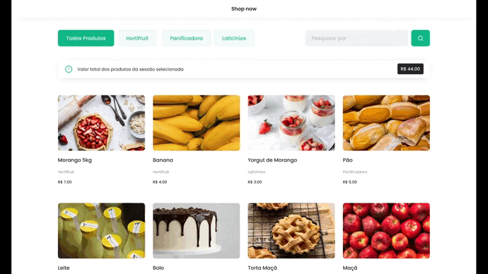

# Entrega: Lista de Produtos

## Introdução

Para começar, faça clone deste repositório.

O objetivo desta entrega é utilizar a manipulação de DOM para montar uma lista de produtos com alguns filtros (como busca, filtro por seção "Hortifruti") e, por fim, mostrar todos os produtos.

Não se preocupe com a parte de estilização, as classes já estão criadas, porém, sinta-se livre para alterar caso ache necessário.

O foco principal da entrega será trabalhar com objetos, manipulação do DOM, uso de métodos de array e string.

## Tarefas

1. Construindo a Lista de Produtos
2. Adicionando os Filtros
3. Calculando o Preço Total
4. Adicionar o sistema de adicionar ao carrinho
